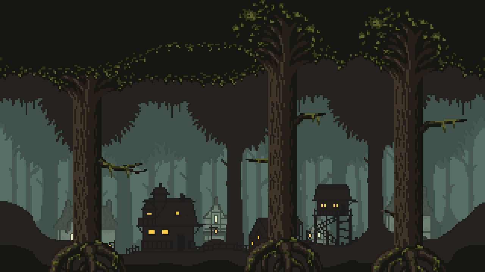

# 🌲 GAME-ScaryForest

<p align="center">
  
</p>

> **Status:** 🚧 Em construção

## 📖 Sobre

Este projeto é um jogo com tema de floresta assustadora, desenvolvido para praticar conceitos de interatividade e animação em ambientes web. O objetivo foi criar uma atmosfera imersiva e uma experiência de jogo utilizando JavaScript.

---

## 🛠️ Tecnologias Utilizadas

*   **Linguagem:** JavaScript
*   **Frontend:** HTML, CSS
*   **Biblioteca:** p5.js

---

## ✨ Principais Aprendizados

*   Criação de cenários e elementos visuais para jogos.
*   Implementação de lógica de movimento e interação do jogador.
*   Gerenciamento de recursos (imagens, sons) em um ambiente de jogo.
*   Desenvolvimento de uma experiência de usuário simples e envolvente.

---

## 🌐 Acesso ao Projeto

Você pode visualizar o projeto em funcionamento através do link abaixo:

**[Clique aqui para ver o projeto online](https://guto2022.github.io/GAME-ScaryForest/)**

---

## 🏁 Como Rodar Localmente

```bash
# 1. Clone este repositório
$ git clone https://github.com/guto2022/GAME-ScaryForest.git

# 2. Acesse a pasta do projeto
$ cd GAME-ScaryForest

# 3. Abra o arquivo 'index.html' em seu navegador.
```

---

## 👨‍💻 Autor

**Augusto Belini Gasparetto**

[](https://www.linkedin.com/in/augustobelinigasparetto/)
[](https://github.com/guto2022)

